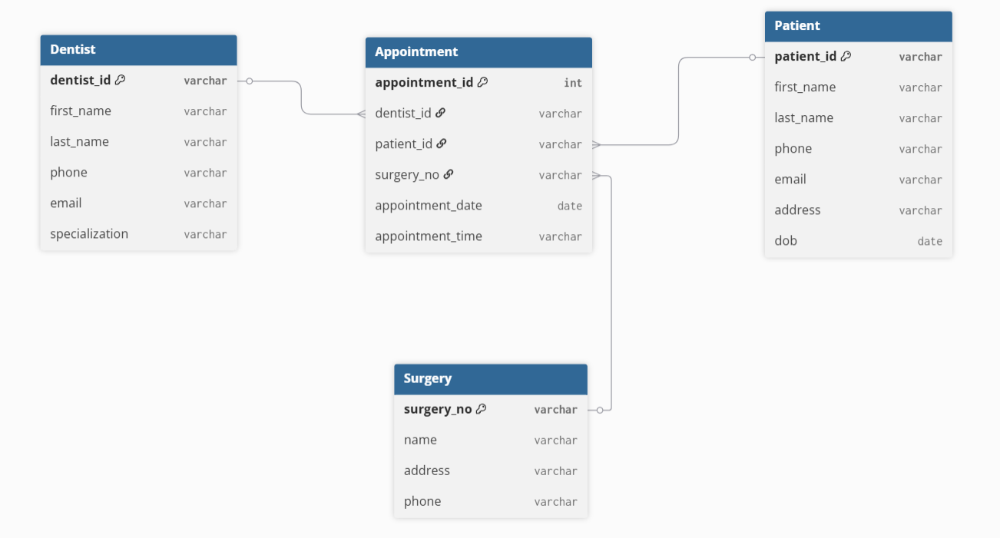
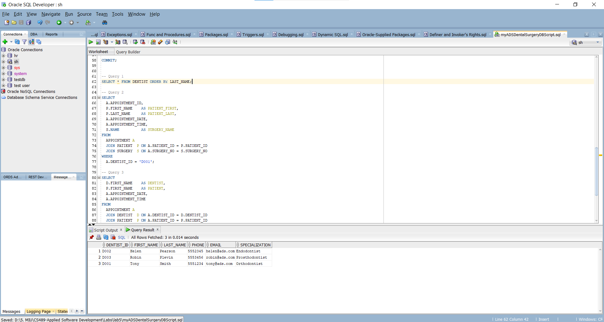
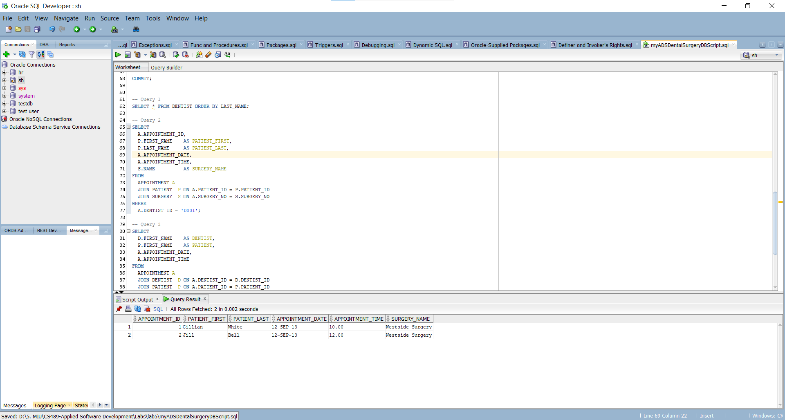
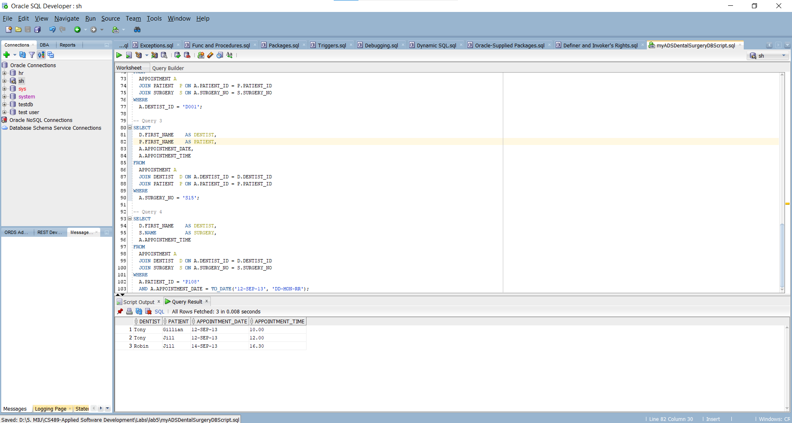
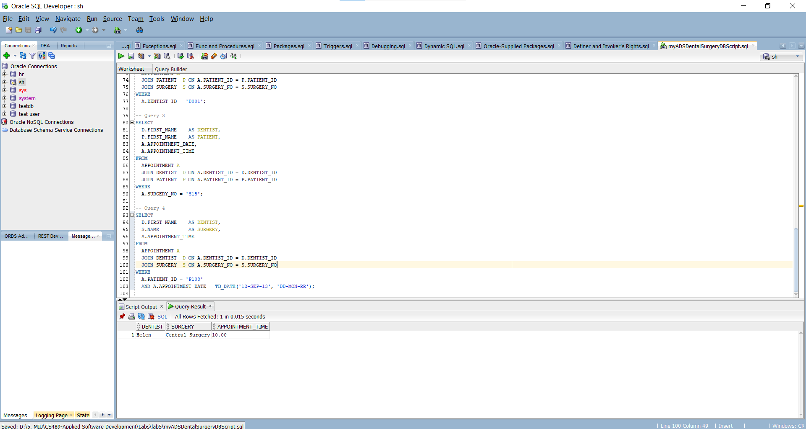

## Lab 5A — Solutions

### 1. ERD



### 2. Target script

- `myADSDentalSurgeryDBScript.sql`

### 3. Queries (with result images)

#### Query 1

```sql
SELECT * FROM DENTIST ORDER BY LAST_NAME;
```

Result: 

---

#### Query 2

```sql
SELECT
  A.APPOINTMENT_ID,
  P.FIRST_NAME    AS PATIENT_FIRST,
  P.LAST_NAME     AS PATIENT_LAST,
  A.APPOINTMENT_DATE,
  A.APPOINTMENT_TIME,
  S.NAME          AS SURGERY_NAME
FROM
  APPOINTMENT A
  JOIN PATIENT  P ON A.PATIENT_ID = P.PATIENT_ID
  JOIN SURGERY  S ON A.SURGERY_NO = S.SURGERY_NO
WHERE
  A.DENTIST_ID = 'D001';
```

Result: 

---

#### Query 3

```sql
SELECT
  D.FIRST_NAME    AS DENTIST,
  P.FIRST_NAME    AS PATIENT,
  A.APPOINTMENT_DATE,
  A.APPOINTMENT_TIME
FROM
  APPOINTMENT A
  JOIN DENTIST  D ON A.DENTIST_ID = D.DENTIST_ID
  JOIN PATIENT  P ON A.PATIENT_ID = P.PATIENT_ID
WHERE
  A.SURGERY_NO = 'S15';
```

Result: 

---

#### Query 4

```sql
SELECT
  D.FIRST_NAME    AS DENTIST,
  S.NAME          AS SURGERY,
  A.APPOINTMENT_TIME
FROM
  APPOINTMENT A
  JOIN DENTIST  D ON A.DENTIST_ID = D.DENTIST_ID
  JOIN SURGERY  S ON A.SURGERY_NO = S.SURGERY_NO
WHERE
  A.PATIENT_ID = 'P108'
  AND A.APPOINTMENT_DATE = TO_DATE('12-SEP-13', 'DD-MON-RR');
```

Result: 

---

Files are in the same folder as this README. The SQL script uses Oracle syntax (VARCHAR2, TO_DATE, identity column).
